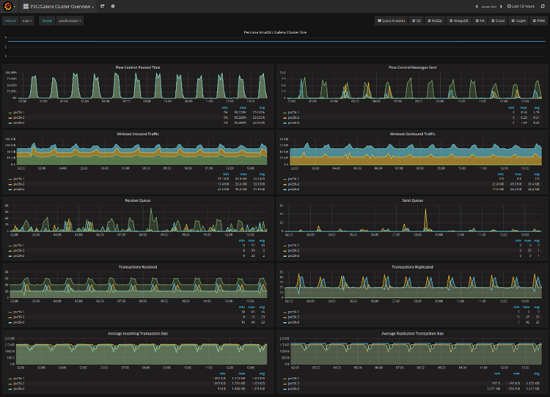
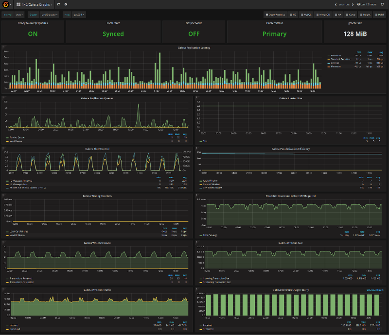

# Monitor the cluster

Each node can have a different view of the cluster.
There is no centralized node to monitor.
To track down the source of issues,
you have to monitor each node independently.

Values of many variables depend on the node from which you are querying.
For example, replication sent from a node
and writes received by all other nodes.

Having data from all nodes can help you understand
where flow messages are coming from,
which node sends excessively large transactions,
and so on.

## Manual monitoring

Manual cluster monitoring can be performed using
[myq-tools](https://github.com/jayjanssen/myq-tools/).

## Alerting

Besides standard MySQL alerting,
you should use at least the following triggers specific to Percona XtraDB Cluster:

* Cluster state of each node

  [`wsrep_cluster_status`](wsrep-status-index.md#wsrep_cluster_status) != Primary

* Node state

  [`wsrep_connected`](wsrep-status-index.md#wsrep_connected) != `ON`

  [`wsrep_ready`](wsrep-status-index.md#wsrep_ready) != `ON`

For additional alerting, consider the following:

* Excessive replication conflicts can be identtified using the [`wsrep_local_cert_failures`](wsrep-status-index.md#wsrep_local_cert_failures) and [`wsrep_local_bf_aborts`](wsrep-status-index.md#wsrep_local_bf_aborts) variables

* Excessive flow control messages can be identified using the [`wsrep_flow_control_sent`](wsrep-status-index.md#wsrep_flow_control_sent) and [`wsrep_flow_control_recv`](wsrep-status-index.md#wsrep_flow_control_recv) variables

* Large replication queues can be identified using the [`wsrep_local_recv_queue`](wsrep-status-index.md#wsrep_local_recv_queue).

## Metrics

Cluster metrics collection for long-term graphing should be done
at least for the following:

* Queue sizes:

  [`wsrep_local_recv_queue`](wsrep-status-index.md#wsrep_local_recv_queue) and [`wsrep_local_send_queue`](wsrep-status-index.md#wsrep_local_send_queue)

* Flow control:

  [`wsrep_flow_control_sent`](wsrep-status-index.md#wsrep_flow_control_sent) and [`wsrep_flow_control_recv`](wsrep-status-index.md#wsrep_flow_control_recv)

* Number of transactions for a node:

  [`wsrep_replicated`](wsrep-status-index.md#wsrep_replicated) and [`wsrep_received`](wsrep-status-index.md#wsrep_received)

* Number of transactions in bytes:

  [`wsrep_replicated_bytes`](wsrep-status-index.md#wsrep_replicated_bytes) and [`wsrep_received_bytes`](wsrep-status-index.md#wsrep_received_bytes)

* Replication conflicts:

  [`wsrep_local_cert_failures`](wsrep-status-index.md#wsrep_local_cert_failures) and [`wsrep_local_bf_aborts`](wsrep-status-index.md#wsrep_local_bf_aborts)

## Use Percona Monitoring and Management

[Percona Monitoring and Management](https://www.percona.com/doc/percona-monitoring-and-management/index.html) includes two dashboards to monitor PXC:

1. PXC/Galera Cluster Overview:

    

2. PXC/Galera Graphs:

    

    These dashboards are available from the menu:

    

Please refer to the [official documentation](https://www.percona.com/doc/percona-monitoring-and-management/index.html) for details on Percona Monitoring and Management installation and setup.

## Other reading

* [Realtime stats to pay attention to in PXC and Galera](https://www.mysqlperformanceblog.com/2012/11/26/realtime-stats-to-pay-attention-to-in-percona-xtradb-cluster-and-galera/)

